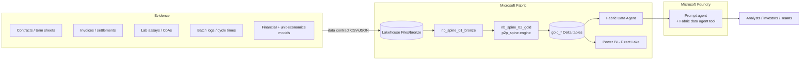

# Procurement-to-Profitability Spine (Microsoft Fabric + Foundry scaffold)

A deterministic data spine that connects **feedstock procurement** to **product realization**
and **plant profitability** for multi-product processing plants such as battery recyclers,
hydrometallurgy, refining or chemical plants. It answers diligence and management questions
with numbers traced to evidence. Where it cannot answer, it says so.

It builds on the patterns in
[procurement-profitability-data-spine](https://github.com/icohangar-ops/procurement-profitability-data-spine):
medallion layers, reason-coded findings, evidence packs with input hashing, and human
ownership gates. It adds the processing-plant economics those patterns were missing.



## What the engine computes

| Module | Answers |
|---|---|
| `payables` | Provisional settlements from wet weight, moisture, assay and payables; invoice reconciliation (missing deductions, stale prices, quantity mismatches); benchmark-payable offtakes with floors, offtaker margin and profit share; feed-to-product **conversion spread** |
| `unit_economics` | Revenue and cost per tonne of feed, EBITDA, **by-product dependency**, **break-even feed payable**, sensitivities, contained metal lost to by-products |
| `grading` | Lot-vs-spec compliance per grade with headroom; highest grade met; untested components block a PASS |
| `pricing` | Fixed, percent-of-index and (index − discount) × content rules; break-even index for a target price; scenario grids |
| `capacity` | Bottleneck capacity from vessel cycle times × batch size × shift pattern; run-rate from batch logs; plan vs actual |
| `evidence` | Evidence grade A-D per model assumption; findings; evidence pack with SHA-256 of every input |
| `questions` | Data-driven question register: each question binds to metrics and renders an answer, or returns `OPEN_GAP` with the missing metric |

It uses only the Python standard library, so the same code runs locally, in CI and inside a Fabric notebook.

## Quick start (local)

```bash
python -m pip install -e ".[dev]"
p2p-spine build --data data/example --out out/example
p2p-spine ask --data data/example --id Q-FEED
pytest -q
```

Outputs: `out/example/gold/*.csv`, `evidence_pack.json`, `report.md`.

## Deploy on Microsoft

See [docs/microsoft-deployment.md](docs/microsoft-deployment.md). In short:

1. `deploy/fabric_deploy.py`: signs you in through the browser, creates the lakehouse, uploads your
   data contract to OneLake, creates both notebooks and (with `--run`) builds the gold tables.
2. Create a **Fabric Data Agent** on the lakehouse. Paste
   [fabric/data_agent/instructions.md](fabric/data_agent/instructions.md) and the
   [example queries](fabric/data_agent/example_queries.md), then publish.
3. `foundry/create_agent.py`: creates a Foundry prompt agent that uses the Fabric data agent tool.

Alternatively, connect the Fabric workspace to this repo with **Git integration**. The `fabric/`
folder holds the notebooks in Fabric's Git source format.

## Adapting to your plant

Everything company-specific lives in a data-contract folder. See
[docs/data-contract.md](docs/data-contract.md). Copy `data/example`, replace the values with
your own evidence (keep the `source` column populated), and write your question register.

## Design rules

- Actual contracts, invoices and lab results are authoritative. Models and management answers are
  claims to test.
- The engine never fills a gap with an estimate. Missing inputs surface as `OPEN_GAP` or `UNTESTED`.
- The evidence pack is advisory until a named owner locks it.

License: MIT. Copyright (c) 2026 Shyam Desigan.
