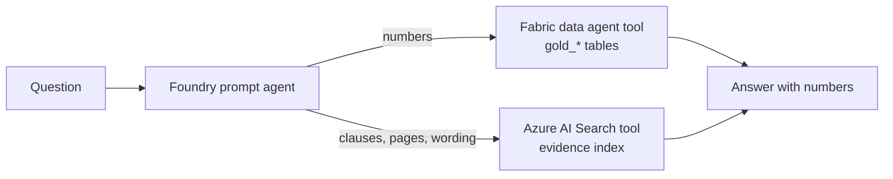
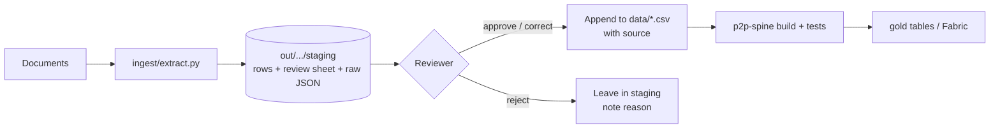

# Azure AI extensions: evidence search and document extraction

Two optional components sit next to the stdlib-only engine in `src/p2p_spine`. Neither one
changes the engine or the data contract.

| Component | Folder | Azure service | Output |
|---|---|---|---|
| Evidence index | `search/` | Azure AI Search (REST `2026-04-01`, GA) and, optionally, Document Intelligence `prebuilt-read` for OCR | Page-level chunks in a search index. The Foundry agent cites them as `file p.N`. |
| Document extraction | `ingest/` | Azure AI Document Intelligence v4.0 (REST `2024-11-30`, GA) | Staging CSVs shaped like `settlements.csv` and `lot_assays.csv`, plus a review sheet |

Install the dependencies with the optional extra, or use them ad hoc with uv:

```bash
python -m pip install -e ".[azure]"          # azure-identity, pypdf, python-docx, openpyxl
# or, without touching any environment:
uv run --no-project --with azure-identity --with pypdf --with python-docx --with openpyxl python search/build_index.py ...
```

HTTP calls use the standard library (`urllib`). The offline code paths (`--dry-run`,
`--from-json`) and the tests need no Azure package.

## Division of labour in the agent



`foundry/agent_instructions.md` sets the split. Numbers come only from the Fabric tool. The search
tool finds and quotes the clause or page behind a number. When a document and the gold tables
disagree, the agent reports both and marks the answer `CONTRADICTED`.

## A. Evidence index (`search/build_index.py`)

1. It walks `--root` and skips hidden and `~$` lock files. On Windows the walk always goes
   through the `\\?\` prefix, so folders deeper than MAX_PATH are still visited. Parsers get a
   short temporary copy of any file whose path is longer than 240 characters.
2. It extracts text per page:
   - PDF: `pypdf`, one page per PDF page. If a PDF has almost no text layer (a scan) and
     `--docintel-endpoint` is set, the whole file goes through `prebuilt-read`.
   - DOCX: `python-docx`. Explicit and last-rendered page breaks move the page counter forward,
     and tables are added to the last page. DOCX has no fixed pagination, so page numbers are
     approximate.
   - XLSX/XLSM: `openpyxl` in read-only mode with cached values. Each sheet counts as one "page"
     (sheet index), and each row is rendered as `a | b | c`.
   - MD/TXT/CSV: read as page 1.
   - PNG/JPG/TIFF: OCR through `prebuilt-read` when `--docintel-endpoint` is set. Otherwise the
     file is skipped and logged.
3. It chunks each page on its own, so a chunk never spans two pages. Chunks are about 1,200
   characters (`--chunk-size`) with a 200-character overlap (`--overlap`), and splits prefer
   paragraph, line, sentence, then word boundaries.
4. It creates or updates the index with `PUT /indexes('name')` and uploads chunks with
   `mergeOrUpload` in batches of 500.

Index fields: `id` (key, `sha1(path)-chunk_no`), `content` (searchable, `en.microsoft`),
`source_path` (relative to the root), `file_name`, `page`, `doc_type`, `folder`, `sha256`,
`chunk_no`, `last_modified`. The semantic configuration `evidence-semantic` is the default: the
title is `file_name`, the content is `content`, and the keywords are `folder` and `doc_type`.

Skipped, oversized (`--max-mb`, default 50), unreadable and text-less files are listed in
`<out>/index_report.csv`, with the reason for each.

```bash
# Offline: extract and chunk to <out>/chunks.jsonl (no Azure calls)
uv run --no-project --with pypdf --with python-docx --with openpyxl \
  python search/build_index.py --root ./dataroom --out out/search --dry-run

# Upload with Entra ID (interactive browser sign-in)
uv run --no-project --with pypdf --with python-docx --with openpyxl --with azure-identity \
  python search/build_index.py --root ./dataroom --endpoint https://<search>.search.windows.net \
  --index spine-evidence --auth interactive

# Upload with an admin key from the environment (the key is never printed)
export AZURE_SEARCH_API_KEY=...        # PowerShell: $env:AZURE_SEARCH_API_KEY = "..."
python search/build_index.py --root ./dataroom --endpoint https://<search>.search.windows.net --api-key

# Include scanned PDFs and images
python search/build_index.py ... --docintel-endpoint https://<di>.cognitiveservices.azure.com
```

Entra ID auth needs RBAC on the search service. Creating the index needs *Search Service
Contributor*, and uploading needs *Search Index Data Contributor*. API access control on the
service must be set to "Role-based" or "Both".

### Wiring the index into the Foundry agent

1. In the Foundry project, add a connection to the Azure AI Search resource and note its name.
   The project's managed identity needs *Search Index Data Reader* (and *Search Service
   Contributor* for the portal flow).
2. Set `AI_SEARCH_CONNECTION_NAME` and `AI_SEARCH_INDEX_NAME`. You can also set
   `AI_SEARCH_QUERY_TYPE` (`semantic` by default, or `simple` on tiers without semantic ranker)
   and `AI_SEARCH_TOP_K` (default 5).
3. Run `foundry/create_agent.py`. It adds an `AzureAISearchTool` alongside the Fabric tool. If
   either variable is missing, the agent is Fabric-only, as before.

```bash
uv run --no-project --with azure-identity --with "azure-ai-projects>=2.7.0" \
  python foundry/create_agent.py --ask "What payable does the offtake contract set for Ni? Cite the clause."
```

## B. Document extraction into staging (`ingest/extract.py`)

| `--kind` | Model | Staged shape |
|---|---|---|
| `invoice` | `prebuilt-invoice` | `settlements.csv` columns. It fills `invoice_id`, `invoice_date`, `counterparty`, `inv_subtotal`, `inv_amount_due` and `doc_ref`, and sets `settlement_id` to `STG-<invoice_id>`. Line items go to `_lines.csv`. |
| `lab_assay`, `coa` | `prebuilt-layout` | `lot_assays.csv` rows (`lot_id, product, lab, component, value, unit, source`) |
| `generic` | `prebuilt-layout` with `keyValuePairs` | Key/value rows for manual triage |

Mapping rules:

- **Invoice.** `counterparty` comes from `CustomerName` by default, which fits a sales invoice
  the plant issued. Use `--counterparty-from vendor` for buyer-issued or self-billed statements.
  If `AmountDue` is missing, the script uses `InvoiceTotal` and says so in `review_notes`. Any
  currency other than USD is flagged. `--metals Ni,Co` adds empty `grade_/price_/price_date_/payable_`
  columns. An invoice alone never yields a complete settlement row: the reviewer fills `wet_kg`,
  `moisture`, grades, prices and payables from the settlement statement.
- **Assay/CoA tables.** Column roles come from the header text: component (element, analyte,
  parameter, ...), value (result, value, concentration, ...), unit (unit, UoM) and lot (lot, batch,
  sample). Specification, limit and method columns are ignored.
  - Long tables have one component per row.
  - Wide tables have one lot per row and one component per column, e.g. `Ni (%)`. The unit comes
    from the header parentheses or from a units row.
  - Units are mapped onto the ones the engine accepts (`%`, `ppm`, `mg/kg`, `g/t`, `ug/kg`, `ppb`).
    For example, `wt%` becomes `%`.
  - `<5`, `n.d.` and `BDL` are flagged, not silently converted. `lot_id` comes from `--lot-id`,
    then a lot column, then a `Lot No:` pattern in the text. If none is found, it is `UNKNOWN_LOT`
    and the row is flagged.
- **Confidence.** Invoice fields use the field confidence. Layout table cells have no confidence,
  so the script uses the lowest word confidence inside the cell. A row is `NEEDS_REVIEW` when its
  confidence is below `--threshold` (default 0.8), no confidence was reported, or a value, unit,
  lot, product or currency problem was found.

Files written, never overwritten, and refused if `--out` is a dataset folder:

```
<out>/staging/<kind>_<UTC ts>.csv          contract columns + review_status, review_confidence, review_notes, source_file
<out>/staging/<kind>_<UTC ts>_review.csv   one line per extracted value: page, value, confidence, status, notes,
                                           reviewer_decision, reviewer_value (for the reviewer to fill)
<out>/staging/<kind>_<UTC ts>_lines.csv    invoice line items
<out>/staging/raw/*.json                   raw analyze responses (audit trail; re-map with --from-json)
```

```bash
# Offline: re-map a saved response (also how the tests run)
python ingest/extract.py --kind lab_assay --from-json tests/fixtures/di_lab_assay.json --product Li2CO3 --lab "Buyer lab"

# Live (key auth: set AZURE_DOCINTEL_KEY; otherwise Entra ID, which needs a custom-subdomain endpoint
# and the "Cognitive Services User" role)
uv run --no-project --with azure-identity python ingest/extract.py --kind invoice \
  --endpoint https://<di>.cognitiveservices.azure.com --auth interactive --metals Ni,Co invoices/*.pdf
uv run --no-project --with azure-identity python ingest/extract.py --kind coa \
  --endpoint https://<di>.cognitiveservices.azure.com --product "Mixed hydroxide" --lab "Buyer lab" coas/*.pdf
```

## C. Human review workflow

Extraction output is a proposal, not evidence. Nothing reaches `data/` without a person approving
it.



1. **Extract.** Run `ingest/extract.py`. Check the printed count of `NEEDS_REVIEW` rows.
2. **Review.** Open `<kind>_<ts>_review.csv` next to the source document. Every line has the file
   and page. For each line, set `reviewer_decision` to `approve`, `correct` or `reject`. For
   `correct`, put the right value in `reviewer_value`. Review every `NEEDS_REVIEW` line. Spot-check
   `OK` lines too, because high confidence does not mean the right table or lot.
3. **Complete.** Fill in the contract columns that extraction cannot derive. For invoices these
   are wet weight, moisture, grades, prices, price dates and payables. For assays they are the
   product name exactly as used in `specs.csv`, and the lab. Keep `doc_ref` / `source` pointing to
   `file#page`.
4. **Append.** Copy the approved rows into `data/<dataset>/settlements.csv` or `lot_assays.csv`,
   keeping only the contract columns. Drop the `review_*` and `source_file` columns. Keep the
   source reference. For settlements, replace the `STG-` id with the dataset's own
   `settlement_id` convention. Record who approved the rows and when (for example in the commit
   message or a findings row).
5. **Rebuild.** Run `p2p-spine build --data data/<dataset> --out out/<dataset>` and the test suite,
   then republish to Fabric. New findings, such as invoice reconciliation differences or grading
   failures, show up in the gold tables.
6. **Keep the trail.** Keep the raw JSON and the completed review sheet with the dataset's
   evidence pack. `--from-json` reproduces the staging rows exactly from the raw responses.

## Verified API surface

| Item | Value | Source |
|---|---|---|
| Azure AI Search data-plane API | `2026-04-01` (latest stable) | https://learn.microsoft.com/en-us/rest/api/searchservice/search-service-api-versions |
| Create/update index | `PUT {endpoint}/indexes('{indexName}')?api-version=2026-04-01` | https://learn.microsoft.com/en-us/rest/api/searchservice/indexes/create-or-update |
| Index documents | `POST {endpoint}/indexes('{indexName}')/docs/search.index?api-version=2026-04-01` (`mergeOrUpload`) | https://learn.microsoft.com/en-us/rest/api/searchservice/documents/index |
| Document Intelligence analyze | `POST {endpoint}/documentintelligence/documentModels/{modelId}:analyze?api-version=2024-11-30`, body `{"base64Source": ...}`, 202 + `Operation-Location` | https://learn.microsoft.com/en-us/rest/api/aiservices/document-models/analyze-document |
| Foundry search tool | `AzureAISearchTool(azure_ai_search=AzureAISearchToolResource(indexes=[AISearchIndexResource(project_connection_id, index_name, query_type, top_k)]))` in `azure-ai-projects` 2.7.0 | https://github.com/Azure/azure-sdk-for-python/blob/main/sdk/ai/azure-ai-projects/samples/agents/tools/sample_agent_ai_search.py |
