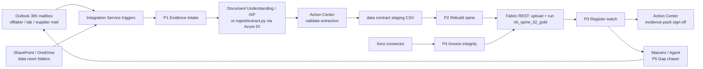

# UiPath automation layer (design)

UiPath handles the work around the spine: collecting evidence, getting humans to review it,
and triggering rebuilds. The spine engine, Fabric and Foundry stay as they are. This is a
solution design; the processes are built in UiPath Studio / Studio Web against these specs.

## Processes

| # | Process | Trigger | Steps | Output |
|---|---|---|---|---|
| P1 | Evidence intake | Integration Service: new email with attachment in `diligence@` / new file in watched SharePoint folders | Classify (invoice, lab assay, CoA, contract, other) → extract (DU/IXP, or call `ingest/extract.py` with Azure Document Intelligence) → Action Center validation task when any field confidence < threshold | Row(s) appended to a staging copy of `settlements.csv`, `lot_assays.csv`, `feed_purchases.csv`, with `source` = original file path |
| P2 | Rebuild spine | P1 approval, or schedule (daily 06:00) | Upload changed contract files to OneLake `Files/bronze/<dataset>/` → run `nb_spine_01_bronze`, `nb_spine_02_gold` via Fabric Job Scheduler API → poll | Refreshed `gold_*` tables and evidence pack |
| P3 | Register watch | P2 completes | Query `gold_question_register` (SQL endpoint): diff status vs. previous run; new CONTRADICTED / BLOCKING findings → Action Center task to the owner; all green → evidence-pack sign-off task | Reviewer decision recorded (who, when, rationale) → stored beside `evidence_pack.json` |
| P4 | Invoice integrity | Nightly | Xero connector: list sales invoices and payments → check unique invoice numbers, amount due vs. contract-basis recomputation (from `gold_settlement_recon`), payments matched to invoices | Findings appended to `findings_manual.csv` (code `INVOICE_CONTROL_*`) |
| P5 | Gap chaser | Weekly, or a new OPEN_GAP | For each OPEN_GAP question: draft a request email to the document owner from `next_action`, track the reply, route the attachment into P1 | OPEN_GAP → ANSWERED without manual chasing |

## Connections (Integration Service)

| Connector | Used by | Scope |
|---|---|---|
| Microsoft Outlook 365 | P1, P5 | Shared diligence mailbox; read and send |
| Microsoft OneDrive & SharePoint | P1 | Data-room folders (read) |
| Xero | P4 | Invoices, payments (read) |
| HTTP / Microsoft Fabric REST | P2, P3 | Entra app (client credentials) allowed by the Fabric tenant setting "Service principals can call Fabric public APIs" and added to the workspace as Contributor |

## Controls

- Nothing auto-appends to the authoritative `data/*.csv`: P1 writes to staging, and a human approves in Action Center.
- Each approval records the reviewer, the timestamp and the source file hash, matching the spine evidence-pack model.
- Credentials live in Orchestrator assets or Azure Key Vault, never in process arguments.
- P4 reads accounting data only; it never posts to Xero.

## Build order

1. P2 (rebuild): smallest, and it makes every other process useful.
2. P1 for invoices and lab assays: removes manual transcription.
3. P4: continuous invoice controls.
4. P3 and P5: governance and gap closing.
